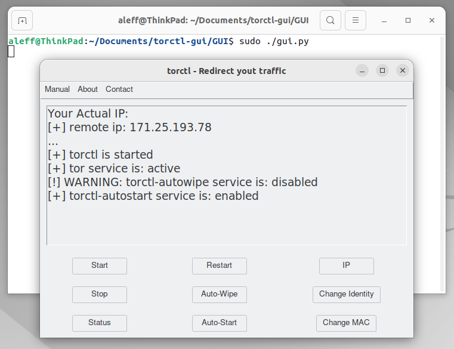

## Description

Script to redirect all traffic through tor network including dns queries
for anonymizing entire system

## Installation

`pacman -S torctl`

## Usage

```
$ torctl
--==[ torctl.sh by blackarch.org ]==--

Usage: torctl.sh COMMAND

A script to redirect all traffic through tor network

Commands:
  start      - start tor and redirect all traffic through tor
  stop       - stop tor and redirect all traffic through clearnet
  status     - get tor service status
  restart    - restart tor and traffic rules
  autowipe   - enable memory wipe at shutdown
  autostart  - start torctl at startup
  ip         - get remote ip address
  chngid     - change tor identity
  chngmac    - change mac addresses of all interfaces
  rvmac      - revert mac addresses of all interfaces
  version    - print version of torctl and exit

```

## GUI

You must run the script with root permissions



## Get Involved

You can get in touch with the BlackArch Linux team. Just check out the following:

**Please, send us pull requests!**

**Web:** https://www.blackarch.org/

**Mail:** team@blackarch.org

**IRC:** [irc://irc.freenode.net/blackarch](irc://irc.freenode.net/blackarch)
